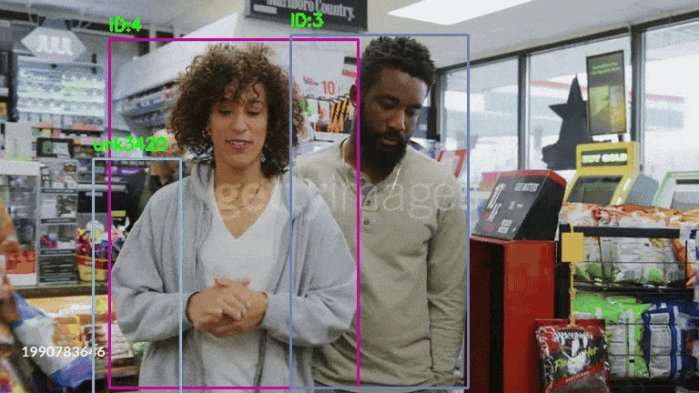

# person_ReID_tracking_software
Cross-video person re-identification using YOLO11 and Deep SORT with OSNet. Assigns consistent global IDs, captures thumbnails, and matches using cosine and histogram similarity. Includes visual tracking, colored ID boxes, and similarity analytics.

# Cross-Video Person Re-Identification with YOLO11 and Deep SORT

This project implements a robust person tracking and re-identification system across multiple videos using:
- **YOLO11** for real-time object detection
- **Deep SORT** with **OSNet** for person re-identification

The system maintains consistent **Global IDs (GIDs)** across different frames and videos by combining **cosine similarity** of feature embeddings with **color histogram similarity**.

---

## 🚀 Features

- **Real-time person detection** using YOLO11  
- **Accurate ID assignment** via Deep SORT with OSNet embeddings  
- **Cross-video tracking** with a persistent global memory  
- **Angle-aware updates**: captures thumbnails every 30 frames to adapt to changes in pose and appearance  
- **Cosine + HSV histogram matching** to boost re-ID reliability  
- **Dynamic bounding box colors** per person for clearer visuals  
- **Similarity analysis tools**: Cosine & Histogram similarity reports and histograms  


---

## 📊 Sample Outputs

- **Tracked Video:** Bounding boxes with consistent GIDs and distinct colors
<p align="center">
  
  
</p>
<p align="center">
  
  
</p>
 
- **CSV Reports:** [Global ID Tracking](output/csv_files/global_id_tracking.csv), [Similarity Report](output/csv_files/similarity_report.csv), Unknown Suggestions
- **Similarity Histograms:** [Cosine Histogram](output/graphs/), [Histogram Similarity](output/graphs/)


---

## 🧠 Models Used

- **YOLO11**: State-of-the-art object detection model  
- **OSNet (via torchreid)**: Lightweight deep learning model (osnet_x1_0_msmt17) trained for re-identification  
- **Deep SORT**: Tracking algorithm extended with appearance features  

---

## 🧪 ID Matching Logic

- Global IDs (GIDs) are matched using both **cosine similarity** and **HSV histogram correlation**  
- **Thresholds** are adjustable to tune detection precision  
- Re-identification improves over time with **periodic embedding updates** from multiple angles  
- Unknowns are labeled as `unk` and tracked independently until confident matches occur  

---

## 🎯 Applications

- **Multi-camera surveillance systems**  
- **Smart city pedestrian analytics**  
- **Security monitoring & forensic analysis**  
- **Video analytics research and benchmarking**

---

## 📬 Contact

For queries, feedback, or collaborations, please [open an issue](https://github.com/Ak0801/person_ReID_tracking_software/issues) or connect via GitHub!


## 🛠 Requirements

```bash
pip install -r requirements.txt
